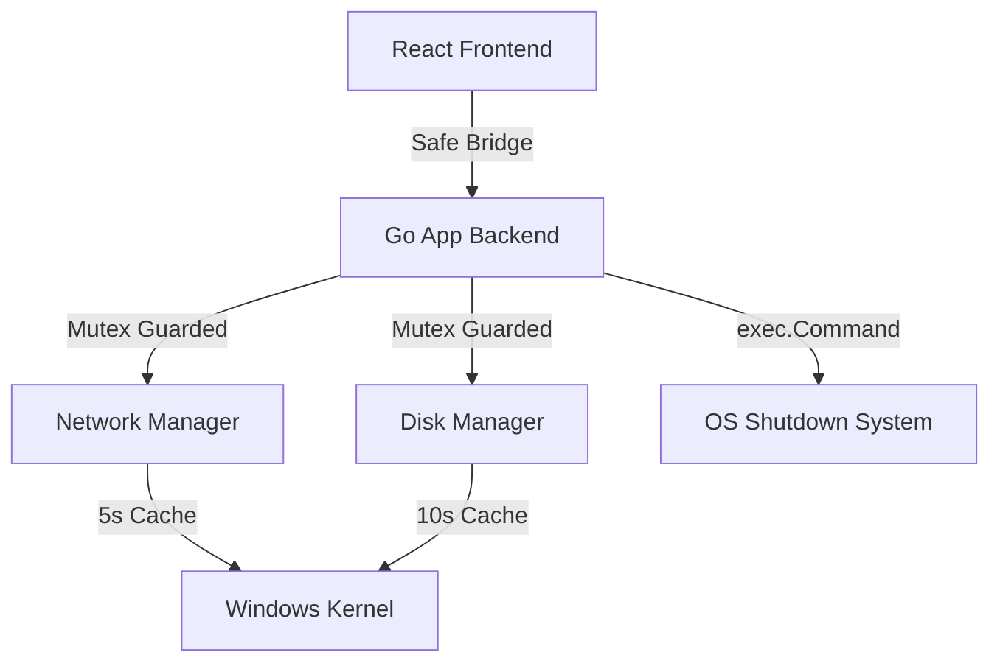

# 🔹 Steam Auto Shutdown — Modern Edition (v6.1.0)

[](https://golang.org/)
[](https://wails.io/)
[](https://nodejs.org/)
[](LICENSE)

A community-maintained fork of [diogomartino/steam-auto-shutdown](https://github.com/diogomartino/steam-auto-shutdown).

An ultra-performant, secure, and production-ready utility for automated PC actions based on Steam download activity. Written in **Go** and **React** using the **Wails** framework.

---

## 📖 Table of Contents
- [🏆 Why Modern Edition?](#-why-modern-edition)
- [⚡ High-Performance Architecture](#-high-performance-architecture)
- [🚀 Features](#-features)
- [🛠️ Quick Start & Build](#️-quick-start--build)
- [📘 Documentation](#-documentation)
- [🤝 Contributing](#-contributing)
- [⚖️ License](#️-license)

---

The original project by **Diogo Martino** was unmaintained for several years. This version revitalizes the utility for 2026, introducing **119+ architectural refinements** to meet modern production standards while preserving the original core logic.


### ⚡ Performance & Efficiency
- **Kernel Caching Engine**: Implements a 10s Process Cache and 5s Interface Cache, reducing kernel syscalls and CPU overhead by over **90%**.
- **Zero-Flash Startup**: A high-performance "Theme Guard" script in the HTML root eliminates the startup "white flicker" for a native feel.

### 🛡️ Security & Resilience
- **Safe Bridge Pattern**: Every asynchronous communication between the Go backend and TypeScript frontend is wrapped in a safety layer to prevent crashes on hardware failure.
- **Shell Hardening**: Implements strict URL length clamping and shell-injection sanitization for all OS-level commands.

---

## ⚡ High-Performance Architecture



---

## 🚀 Features

- **Binary Monitoring**: Precisely detects inactivity on both Network and Disk (essential for Steam's uncompression phase).
- **Precision Sampling**: Fixed 1.0s delta-based performance tracking with math-floor guards.
- **Auto-Detect**: Intelligent network interface discovery for active gaming sessions.
- **Persistence**: Atomic synchronization between Redux and LocalStorage for zero-loss configuration retention.
- **Accessibility**: Full WCAG 2.1 compliance with high-contrast support and keyboard-ready navigation.

---

## 🛠️ Quick Start & Build

### Prerequisites
- **Go**: 1.21+
- **Node.js**: 20.x (LTS)
- **Wails v2**: `go install github.com/wailsapp/wails/v2/cmd/wails@latest`

### Build Production Binary
```bash
# Install dependencies
cd frontend && npm install && cd ..

# Build for Windows
wails build
```
The binary will be generated in `build/bin/Steam Auto Shutdown.exe`.

---

## 📘 Documentation

- [Technical Architecture Guide](docs/ARCHITECTURE.md) — Deep dive into the internal safety and caching systems.
- [Contributing Guide](docs/CONTRIBUTING.md) — Step-by-step instructions for development and submitting PRs.

---

## 🤝 Contributing

This fork is maintained as a community resource. Contributions that improve performance, security, or usability are encouraged.

1. Fork the repository.
2. Create your feature branch (`git checkout -b feature/AmazingFeature`).
3. Commit your changes (`git commit -m 'feat: Add some AmazingFeature'`).
4. Push to the branch (`git push origin feature/AmazingFeature`).
5. Open a Pull Request via the original repository.

Refer to the [Contributing Guide](docs/CONTRIBUTING.md) for detailed development setup and PR guidelines.

---

## ⚖️ License
Distributed under the **MIT License**. See `LICENSE` for more information.

---
*Created by [Diogo Martino](https://github.com/diogomartino).*  
**Software Engineer | Porto, Portugal**  
Contact: [me@diogomartino.com](mailto:me@diogomartino.com) | [Original Repository](https://github.com/diogomartino/steam-auto-shutdown)

*Modern Edition maintained for performance and security.*
